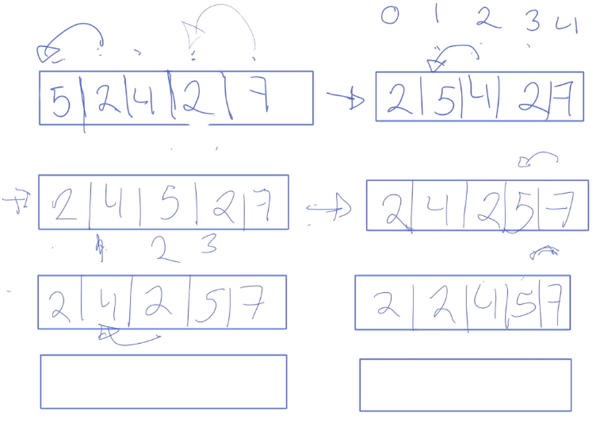

# Bubble Sort

Es el algoritmo más simple de todos los algoritmos de ordenamiento. Funciona cambiando las celdas adyacentes en caso de que no estén ordenadas. Y va de par en par.

<figure>
    
    <figcaption>Bubble sort, gráfica</figcaption>
</figure>

## Pasos a seguir

1. Comenzamos a hacer la comparación con los elementos adyacentes
2. Repetimos hasta tener una pasada completa sin ningún swap

## Implementaciones

1. [Bubble sort en C](./bubble_sort.c)
2. [Bubble sort en JS](./bubble_sort.js)
3. [Bubble sort en Python](./bubble_sort.py)