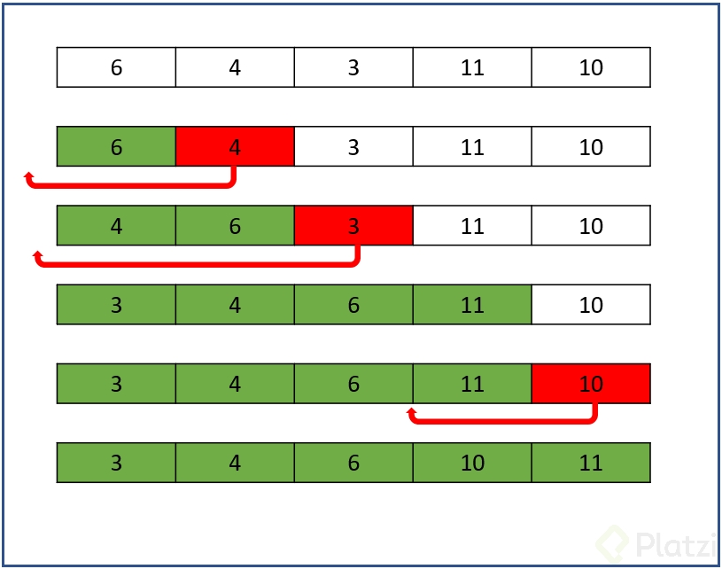

# Insertion Sort

## Definición

Insertion Sort es un algoritmo simple que ordena individualmente cada valor, como lo harías al ordenar un set de cartas del juego UNO en tu mano.

<figure>
    
    <figcaption></figcaption>
</figure>

## Pasos

Como puedes observar en la imagen:

1. Recorremos nuestro set de datos posición por posición y comparamos el número con los valores anteriores, en caso de ser menor, lo colocamos en su posición indicada para ordenar de menor a mayor.

## Implementaciones

1. [Insertion sort en C](./insertion_sort.c)
2. [Insertion sort en JS](./insertion_sort.js)
3. [Insertion sort en Python](./insertion_sort.py)