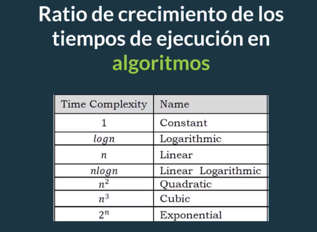

# ¿Cómo comparar algoritmos?

- Tiempos de ejecución: no es una buena métrica.
- Número de instrucciones ejecutadas: no es una buena métrica.

Asumamos que vamos a representar nuestro algoritmo como una función que va a depender del tamaño de la entrada. Esto nos va a permitir comparar los diferentes tiempos de ejecución independientemente del tiempo que consume la máquina en resolver el algoritmo, el estilo de programación que estemos ocupando o del lenguaje que éstemos utilizando.

## Ritmo de crecimiento (rate of growth)

<figure>
    
    <figcaption></figcaption>
</figure>
