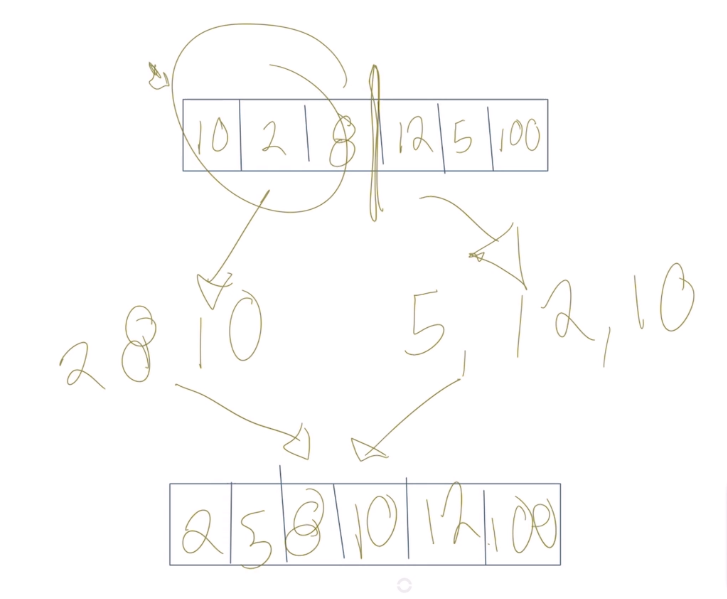

# Divide and conquer (divide y vencerás)

Consta en agarrar un problema grande, por ejemplo, un gran set de números y dividirlo, es decir, hacer problemas más pequeños del mismo tipo.

Si tienes un problema de ordenamiento que tiene un millón de datos, podrías dividirlo en diez problemas que igual van a ser de ordenamiento y vas a resolver recursivamente cada uno de los problemas. A eso se le llama conquistar.

## Dividir

Resolver el problema

## Conquistar

Donde resuelves cada uno de los bloques de tu problema mayor

## Combinar

Unir los resultados

<figure>
    
    <figcaption>Implementación gráfica de divide and conquer (divide y vencerás)</figcaption>
</figure>

