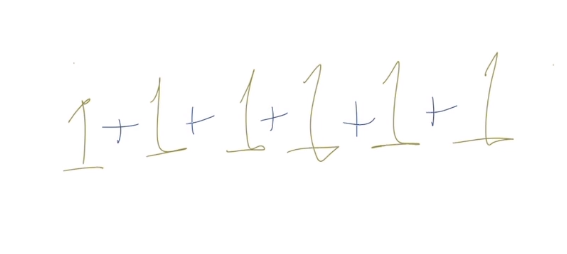

# ¿Qué es la programación dinámica?

Es un método para resolver problemas grandes o complejos, simplemente rompiéndolos en una colección de subproblemas simples. Tal como hicimos en divide and conquer sólo que acá una giro, el concepto de programación dinámica nos agrega una cosa más, y es que cada uno de los subproblemas que se van resolviendo se van guardando automáticamente y se van acomodando automática, ahí esta lo dinámico. A diferencia del divide and conquer donde simple y sencillamente agarrabamos, dividíamos, resolvíamos y uníamos, aquí la unión se va haciendo conforme nosotros vamos desarrollando nuestro programa. Esto es lo que le da el dinamismo a nuestra implementación, de hecho, el quick sort hace uso de esto.

## Ejemplo

Tenemos la siguiente suma:

<figure>
    
    <figcaption>Resuelve la suma</figcaption>
</figure>

Son seis números 1 sumándose consecutivamente, entonces tenemos el número 6. Ahora bien, que sucedería si le sumamos otro uno.

<figure>
    
    <figcaption>Resuelve el nuevo valor</figcaption>
</figure>

Tendríamos un 7. ¿Por qué lo pudiste sumar tan rápido? Bueno, porque ya previamente cual era el resultado de la suma anterior. Esto es programación dinámica simplificada aún a su máxima expresión. Tu programa lleva la cuenta de todos los cálculos, ordenamientos o lo que esté haciendo y cuando le agregas una nueva operación simplemente la acumula dinámicamente. El algoritmo quicksort, si bien hace uso de divide y vencerás porque divide tu programa y después va resolviendo cada una de las partes que dividió, también implementa el método dinámico.