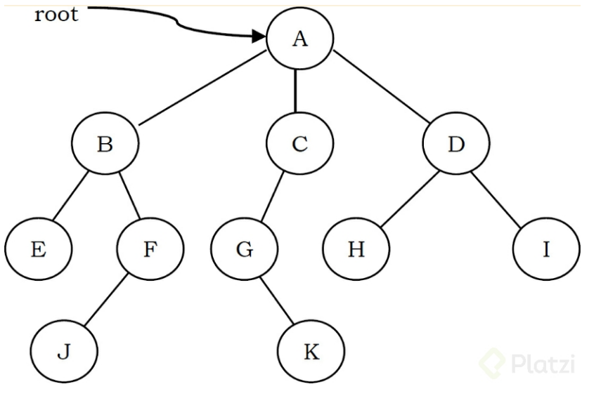
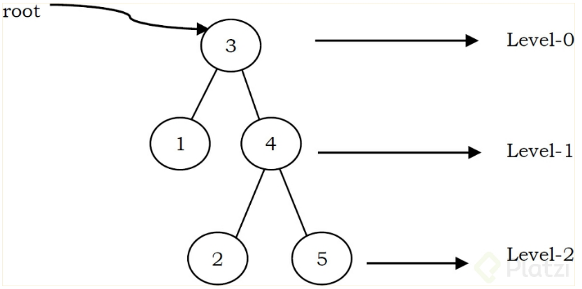

# Árboles

Un árbol es una estructura de datos similar a una lista pero en lugar de que cada nodo apunte al siguiente de forma lineal, cada nodo apunta a un número de nodos.

Un árbol es un ejemplo de una estructura de datos no lineal y es la forma de representar la naturaleza jerárquica de una estructura en forma gráfica.
Los árboles también funcionan como un tipo de datos abstracto que cuenta con su definición y descripción de propiedades y operaciones, y se diferencia principalmente de las listas, queues (colas) y pilas porque a diferencia de estas no se utiliza para ordenar elementos de forma lineal.

<figure>
    
    <figcaption></figcaption>
</figure>

La raíz (root) de un árbol es el nodo sin nodos padres, un árbol puede tener máximo una raíz, como el nodo A en el ejemplo anterior.
Un enlace o “edge” se refiere al enlace entre un nodo padre a un nodo hijo.
Un nodo sin nodos hijos se conoce nodo “hoja” como los nodos E, J, K, H, I.
Los nodos hijos del mismo padre se conocen como “hermanos” (Siblings) por ejemplo, los nodos B, C, D son nodos hermanos hijos de A.
Por otro lado, los nodos anteriores a un nodo dado en la ruta hacia la raíz se conocen como ancestros, como G, C, y A para el nodo K en nuestra imágen de ejemplo.
El set de todos los nodos a cualquier profundidad dada se conoce como “nivel del árbol” en nuestro ejemplo B, C, D son del mismo nivel (nivel 1) siendo la raíz el nivel 0.

<figure>
    
    <figcaption></figcaption>
</figure>

La profundidad de un nodo es la longitud del camino desde la raíz hasta el nodo, por ejemplo el nodo G tiene una profundidad de 2, A(1) - C(2) - G.
La altura de un nodo es el largo del camino del ndo al nodo más profundo por ejemplo en nuestra imágen la altura de B es 2, B - F(1) - J(2).
La altura del árbol es la altura máxima entre todos los nodos en un árbol, para un árbol la altura y la profundidad retornará el mismo valor, pero para nodos individuales podemos tener diferentes resultados, en el caso de nuestro árbol de ejemplo la altura y profundidad son de 3.