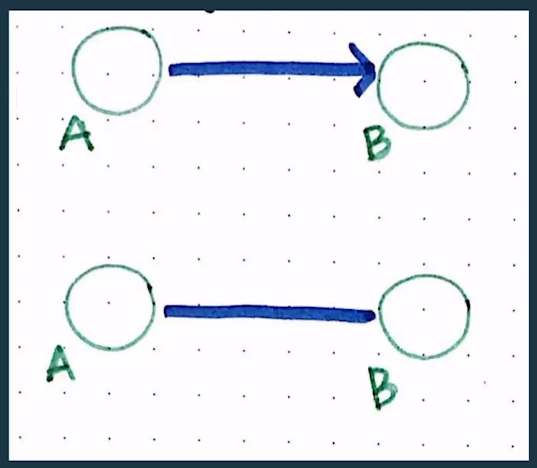
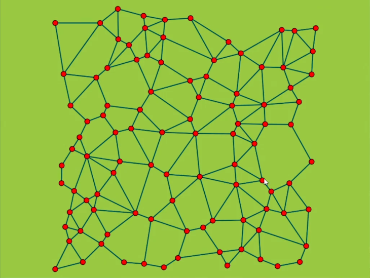
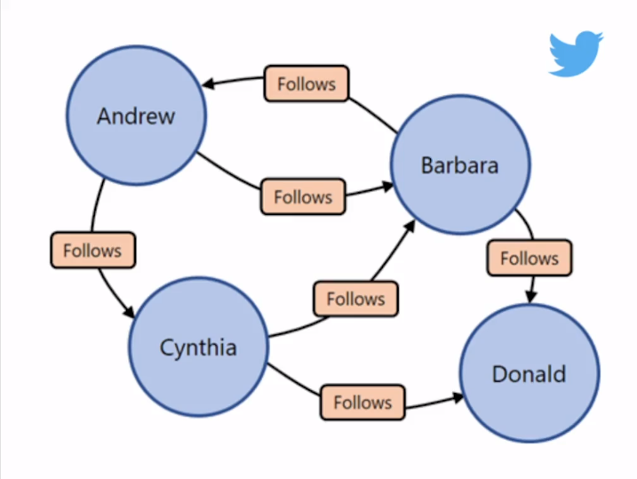
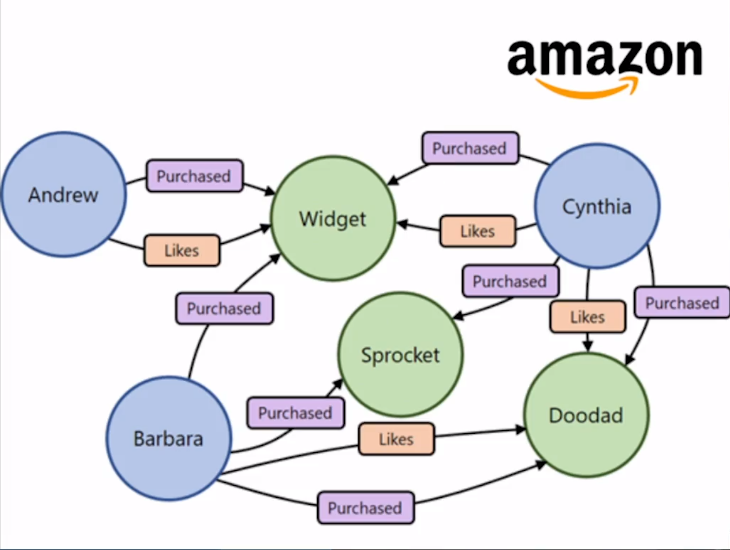

# Grafos y sus aplicaciones

## ¿Qué es un grafo?

Es una estructura donde se almacena un set de objetos en los cuales algunos pares del objeto de alguna forma van a estar relacionado. Vas a encontrar al menos un par conectado, y las conexiones puede ser más o menos.

## Ejemplos

<figure>
    
    <figcaption>Relación unidireccional y bidireccional</figcaption>
</figure>

<figure>
    
    <figcaption>Ejemplo de grafos interconectados entre si</figcaption>
</figure>

## Letras principales

- G: La representación matemática del grafo.
- V: Set nodos (también llamados vértices).
- E: Enlaces o edges.

> G = (V, E)

## Ejemplos reales de aplicaciones de grafos

<figure>
    
    <figcaption>Ejemplo de como Facebook aplica los grafos</figcaption>
</figure>
<figure>
    
    <figcaption>Ejemplo de como Twitter aplica los grafos</figcaption>
</figure>
<figure>
    
    <figcaption>Ejemplo de como Amazon aplica los grafos</figcaption>
</figure>

