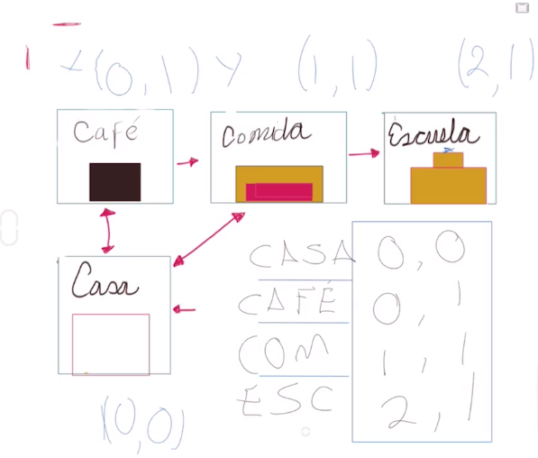
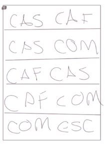

# Estructuras de datos

Al momento de resolver problemas a través de código con nuestros algoritmos, necesitamos alguna forma o algún mecanismo de guardar los datos. Los programas siempre van a estar trabajando con información, ésta forma organizada, estructurada, eficiente y específica de almacenar la información va a ser conocida como una estructura de datos. Generalmente hay varias que están ya implementadas en muchos lenguajes, por ejemplo:

- Arreglos (Array)
- Listas
- Listas enlazadas
- Árboles
- Grafos

## Clasificación

### Estructuras de datos lineales

La información se guarda secuencialmente, una tras otra, o de alguna forma lineal que se le indique. Por ejemplo, primero la información más relevante, etc.

### Estructuras de datos no lineales

Cómo los árboles y grafos, en un árbol tenemos un tronco principal y las ramificaciones que van surgiendo del tronco. También tenemos los grafos que son puntos de información que vamos a tener dispersos en toda la estructura y que van a estar interconectados entre sí.

## Ejemplo

A continuación vamos a crear una [matriz de adyacencia](#matriz-de-adyacencia). El ejemplo es, dada la siguiente imagen, deseamos conocer el camino más corto desde la casa a la escuela.

<figure>
    
    <figcaption>Cada edificio tiene sus coordenadas y tenemos los sentidos de las vías entre edificio</figcaption>
</figure>

Como no hay una única ruta y deseamos obtener la ruta más corta, debemos desarrollar una tabla donde podamos comparar las distancias que hay de un punto a otro. Viendo la imagen anterior, ¿cuál sería la ruta más corta de la casa a la escuela?, de la casa al restaurante y del restaurante a la escuela. Para nosotros esto es evidente porque sómos humanos, pero un computador no tiene la lógica con la que nosotros nacemos. Debemos indicarle al computador la forma lógica de hacerlo.

Ahora bien, una manera de empezar sería definir las posibles rutas, serían:

- casa-café-comida-escuela
- casa-comida-escuela

El problema es que éstas las podemos detectar nosotros, porque tenemos una vista amplia del problema, pero un computador no puede, un computador puede detectar las adyacencias, que puntos tiene al lado un punto, y con ésto obtendría la información necesaria para desarrollaor el algoritmo.

<figure>
    
    <figcaption>Tabla de adyacencias</figcaption>
</figure>

## Glosario

### Matriz de adyacencia

La matriz de adyacencia es una matriz cuadrada que se utiliza como una forma de representar relaciones binarias. [Más información](https://es.wikipedia.org/wiki/Matriz_de_adyacencia)
