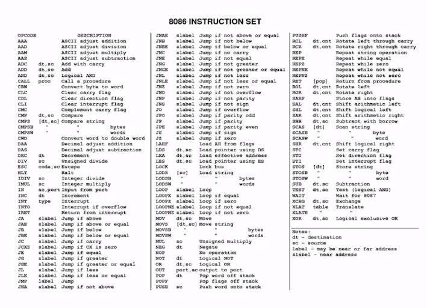
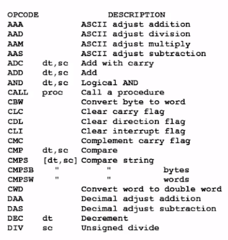
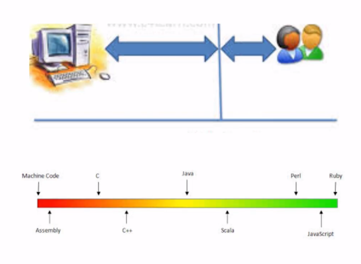

# Lenguajes de programación

Un set de instruccionas específicas que le enseñan a las computadoras los pasos a seguir para resolver algún problema. Es la forma en que nosotros nos comunicamos con las computadoras.

Existen muchos lenguajes programación, por ejemplo:

## Lenguajes máquina y ensamblador

Son lenguajes viejos.

### Máquina

Lenguaje máquina es el lenguaje que existía directamente para darle a través de ceros (0) y unos (1) las instrucciones que la computadora va a entender, que los circuitos internos de la computadora pueden interpretar a través de pulsos electricos (bit).

### Ensamblador

Era un lenguaje mucho más amigable con los humanos, ya no eran sólo ceros (0) y unos (1). Teníamos un set de instrucciones que nos daba el fabricante del circuito integrado.

<figure>
    
    <figcaption>El 8086 era un CPU de Intel que tenía éste set de instrucciones.</figcaption>
</figure>

Cada una de éstas instrucciones tenía una forma de ser leída directamente en el hardware del código, entonces, el lenguaje ensamblador es súper eficiente porque le estás diciendo directamente al cpu que instrucciones debe ejecutar.

Pero no es tan eficiente para aprenderse por un húmano.

<figure>
    
    <figcaption>Tenemos instrucciones como éstas que podrían considerarse bastante abstractas</figcaption>
</figure>

#### Explicación de algunas instrucciones

- ADD: Se encarga de sumar los valores de dos registros de la memoria
- AND: Logical and

#### Ensamblador vs Hoy en día

<table>
    <thead>
        <tr>
            <th>Ensamblador</th>
            <th>Hoy en día</th>
        </tr>
    </thead>
    </tbody>
        <tr>
            <td>ADD</td>
            <td>Declaras dos variables y utilizas el símbolo de sumar, no debes preocuparte por los registros de memoria</td>
        </tr>
        <tr>
            <td>AND</td>
            <td>&</td>
        </tr>
    <tbody>
</table>

## Lenguajes de bajo y alto nivel

<figure>
    
    <figcaption>Umbral de nivel de lenguajes.</figcaption>
</figure>

### Lenguajes de bajo nivel

El código máquina y ensamblador son dos lenguajes que existen desde que existen los primeros CPU que iban a ser capaces de leer código de computadoras. Éstos lenguajes son de súper bajo nivel, van directo al CPU y no tienes un overhead o una carga que haga que sea más lento el procesamiento de las instrucciones, si tu instrucción requiere dos ciclos del CPU para ejecutarse, por ejemplo leer un espacio de la memoria y luego leer otro, entonces te costó dos instrucciones, dos ciclos de reloj de tu CPU, eso te va a costar y ya.

### Lengujes de medio nivel

C, C++, Java y Scala, van a ser lenguajes que te pueden servir para hablarle directo a una computadora. C y C++ se ocupan en sistemas embebidos, que son éstas microcomputadoras que viven en tu lavadora, tu microondas, entre otros, justo por eso.

### Lenguajes de alto nivel

JavaScript, Ruby, Perl, Python, entre muchos otros. Van a necesitar ser interpretados en la computadora, una instrucción de éste lenguaje luego pasa a la conversción, el intérprete es como un traductor y se encarga de que éste código que estás escribiendo le llegue al CPU, de hecho, antes le llega al sístema operativo y por último al CPU. Por eso son de alto nivel, hay muchas capas antes de que tú puedas llegar a tu CPU. Son lenguajes que no son eficientes para aplicaciones de súper alto rendimiento, como por ejemplo, un robot. Pero están para una página web o un celular porque tenemos muchos recursos de hardware hoy en día.