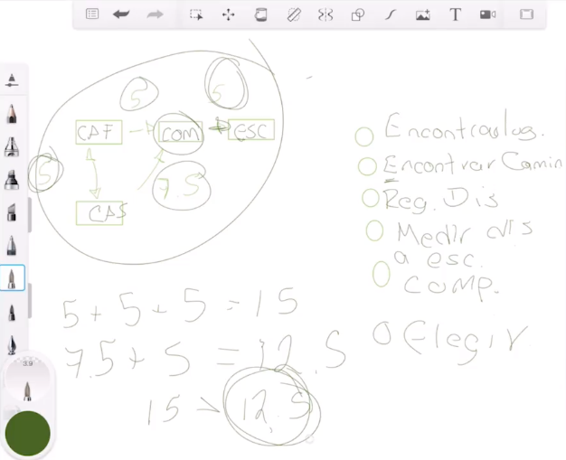

# ¿Qué es un algoritmo?

Un algoritmo es un conjunto de instrucciones que resuelven un problema dado paso a paso y sin generar ambigüedades. Los pasos que tú le des a la computadora van a llegar al mismo resultado siempre y cuando le pongas los mismos datos de entrada.

## Ejemplo

<figure>
    
    <figcaption>Pasos lógicos a seguir en nuestro algoritmo</figcaption>
</figure>

## Algoritmo de Dijkstra, o algoritmo de la ruta más corta

El algoritmo de Dijkstra, también llamado algoritmo de caminos mínimos, es un algoritmo para la determinación del camino más corto, dado un vértice origen, hacia el resto de los vértices en un grafo que tiene pesos en cada arista. Su nombre alude a Edsger Dijkstra, científico de la computación de los Países Bajos que lo describió por primera vez en 1959. [Más información](https://www.ecured.cu/Algoritmo_de_Dijkstra)